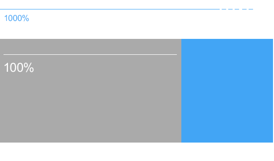

وانیلا؛ نه فِریم وورکه نه یک کتابخونه تازه و نه چیزی شبیه به این. وانیلا یک جور ایده است با این هدف که توسعه دهنده‌هایِ جاوا‌اسکریپت، ترغیب بشن تا به صورت ساده و بی هیچ ابزاری برنامه‌نویسی کنن. البته نه به این جهت که ابزار‌ها بد هستن، به این خاطر که اکثر اونها دائم تغییر میکنن و حتی منسوخ میشن! و طبیعی هست که ما برای بقا، به دانشی بیشتر از دونستن راه تعامل با اون ابزار‌ها احتیاج داریم. بیشتر از این در مورد وانیلا توضیح نمیدم اگر به دنبال اطلاعات بیشتری هستید به [اینجا](https://snipcart.com/blog/learn-vanilla-javascript-before-using-js-frameworks) مراجعه کنید.

<!-- excerpt -->

## بریم سراغ اصل مطلب

قراره روند ساختِ یک اسلاید‌شو‌ رو بدون در نظر گرفتنِ فایل‌های HTML و CSS اون، با هم مرور کنیم. تو این آموزش کمی هم از ویژگی‌های ES6 استفاده کردم که البته این استفاده خیلی گسترده نیست و سعی میکنم هر جا که لازم بود، توضیحات کوتاهی برای درک بهتر هرکدوم بنویسم.<br/>برای آغاز کار میتونید فایل‌های مربوط به پروژمون رو از [اینجا]({{ site.url }}/download/Training-Files.zip)دانلود کنید. پیشنهادم اینه که با استفاده از فایلِ <mark>index-start.html</mark> که در حال حاضر دانلود کردید، قدم به قدم با هم پیش بریم، البته اجباری نیست، میتونید هر طور که مایل هستید از این آموزش استفاده کنید.

نتیجه کار نهایی‌مون رو هم میتونید این پایین ببنید.

<iframe height='418' scrolling='no' title='Image slider by vanilla javaScript' src='//codepen.io/rzkhosroshahi/embed/MpyJKz/?height=418&theme-id=28195&default-tab=result&embed-version=2' frameborder='no' allowtransparency='true' allowfullscreen='true' style='width: 100%;'>See the Pen <a href='https://codepen.io/rzkhosroshahi/pen/MpyJKz/'>Image slider by vanilla javaScript</a> by Reza (<a href='http://codepen.io/rzkhosroshahi'>@rzkhosroshahi</a>) on <a href='http://codepen.io'>CodePen</a>.
</iframe>

## اسلاید‌شو ما چطور کار میکنه؟

تصور کنید یک نوار نگاتیو دستتون گرفتید و هر بار به یکی از عکس‌ها نگاه میکنید و بلافاصله عکس فعلی‌و رد میکنید و بعدی و بعدی و .… کاری هم که ما قراره انجام بدیم تقریبا مشابه همین اتفاق است. بخش اصلی از فایل HTML رو پایین میبینید. همونطور که مشخصه عنصر با کلاس <mark>slide</mark> حکم نوار نگاتیو رو داره و عناصر داخلی هم که مشخصا عکس‌ها هستن.<br/> حالا بریم ببینیم چطور با CSS به عناصر طوری استایل بدیم که بتونیم به حرکت دربیاریمشون.

```html
<div class="slide">
  
  
  
  
  
</div>
```

ما به عنصر <mark>slide</mark> با دادن مقدار هزار درصد به عنوان طول <mark>width: 1000%</mark> گفتیم که حداکثر ده عدد عکس رو داخل خودش جا بده، و از طرفی هر کدوم از این عکس‌ها طولی برابرِ <mark>width: 10%</mark> رو داشته باشن. اگه بخوام کمی بیشتر توضیح بدم، دقت کنید که در نهایت هر کدوم از عکس‌ها صد درصد از هزار درصدِ عنصرِ والدشون رو میگیرن و از طریقِ این مفهوم، با یک حساب ساده متوجه میشید که چرا ده عدد عکس داخل این عنصر جا میگیره و یازدهمین عکس به خط بعدی منتقل میشه.<br/>در ادامه با دادن استایلِ <mark>overflow: hidden</mark> به عنصر slide، قرار میگذاریم اگر عکس‌های داخل این عنصر از ۱۰۰ درصدِ اسلاید سرریز کرد، باقیِ اون صد در صد رو مخفی کنه. با این کار ما هر بار تنها یک عکس‌ رو خواهیم دید که صد درصدِ عنصرِ اسلاید‌ رو گرفته.


## اسلاید قراره چطور به حرکت دربیاد؟

حلقه آخر کار ما با CSS دقیقا همینجاست. تنها کاری که باید انجام بدیم این هست که عنصر اسلاید‌مون رو هر بار به اندازه‌ ۱۰ درصد (طول هر عکسِ داخل عنصر اسلاید)، به سمت چپ یا راست به به حرکت دربیاریم با اینکار هر بار تنها یک عکس‌رو مشاهده می‌کنیم. به همین راحتی :) <br/>این کار به راحتی و با استفاده از استایلِ <mark>transform: translateX</mark> ممکن خواهد شد.

## شروع کار با جاوااسکریپت

### قدم اول انتخاب عناصرِ HTML

بین تگ <mark>script</mark>شروع کنید به نوشتنِ کد‌ها.<br/>خیلی آسون میتونیم با <mark>document.querySelector</mark>، عناصر صفحه‌مون رو براساس کلاس، آیدی، نامِ تگ‌ها، اتریبیوت‌های تگ‌ها و… انتخاب کنیم. بریم تگ اسلاید و عکس‌هامون و دکمه عقب و جلو رو انتخاب کنیم:

```javascript
//selectors
const slide = document.querySelector(".slide")
const imgAll = slide.querySelectorAll("img")
const nextBtn = document.querySelector(".next")
const pervBtn = document.querySelector(".perv")
```

یک نکته تو انتخاب عکس‌ها وجود داره، اون اینه که ما تمام عکس‌هایی که داخل عنصرِ اسلاید بود رو انتخاب کردیم. این کار‌و هم فقط با اضافه کردنِ حرف All به انتهای انتخابگرمون انجام دادیم.

### قدم دوم تعریف رویدادِ کلیک برای دکمه‌ها

این که اسلاید ما متوجه کلیک شدن دکمه‌ای بشه و بعد تابع خاصی رو اجرا کنه هم خیلی ساده با استفاده از <mark class="en">nextBtn.addEventListener(‘click’,//run func)</mark> اتفاق می‌افته. خیلی ساده به محضِ‌ اینکه دکمه <mark>nextBtn</mark> کلیک بشه تابع مورد نظر ما اجرا میشه. کد‌های زیر‌و هم وارد کنید.

```javascript
nextBtn.addEventListener("click", slideNext)
pervBtn.addEventListener("click", slidePervious)
```

### قدم سوم تعریف تابع slideNext

بهتره این قسمت از کد رو بین دو قطعه کدی که تا الان نوشتیم قرار بدید. اما بعد…<br/> ما قراره با هر بار کلیک بر روی دکمه <mark>next</mark> عکس بعدی‌مون رو ببینیم اصطلاحا به عکسِ بعدیمون اسلاید کنیم. یادآوری میکنم چند پاراگراف بالاتر گفتیم هر عکس داخل عنصر slide به اندازه ده درصد از عنصر والدِ خودش رو اشغال میکنه و <mark>overflow: hidden</mark> باعث میشه که ما فقط ده درصد از کل فضایی که عنصر <mark>slide</mark> اشغال کرده‌ رو ببینیم، پس برای اینکه بتونیم به عکس بعدی اسلاید کنیم، کافیه عنصرِ اسلاید هر بار با اجرای این تابع ۱۰ درصد به سمت راست یا چپ حرکت کنه که اینکارو هم توضیح دادم با استفاده از چه خاصیتی از css قادر به انجامش هستیم و خبر خوب اینه که جاوا‌اسکریپت این امکان رو به ما داده که به راحتی به عناصرمون استایل بدیم، دقیقا مشابه کاری که پایین انجامش دادیم.

```javascript
function slideNext() {
  slide.style.transform = `translateX(${-10}%)`
}
```

یک نکته؛ اینجا ما برای راحتی کار از ویژگیِ‌ تازه‌ای از ES6 با سینتکسِ <mark class="en">\${…}</mark> استفاده کردیم که با عنوانِ [template strings](http://wesbos.com/javascript-template-strings/) شناخته میشه، و کار ما رو برایِ ترکیب انواع مختلف داده‌ها برای فرستادن به تابع‌مون آسان‌تر میکنه، برای نمونه اگر به قطعه کد بالا دقت کنید، میبینید که ما ترکیبی از علامتِ عدد به همراه عدد و هم‌چنین واحد اندازه گیریِ درصد رو بدون هیچ مشکلی به راحتی کنار هم استفاده کردیم.

اگر حالا نتیجه کارمون‌رو تست کنیم، میبینیم با این روند تنها به عکسِ دوم اسلاید میکنیم و این اتفاق در موردِ عکس‌های دوم و سوم و… نمی‌افته چرا؟! به این دلیل که با هر بار اجرای تابع slideNext مقدارِ translateX مساوی با <mark class="en"> -10% </mark> میشه، در صورتی که ما قرارمون این بود که با هر بار کلیک بر روی دکمهِ بعدی مقدار translateX ده درصد کم یا زیاد بشه و به عبارتی آپدیت بشه. بهترین راه حل این است که، در لحظه از مقدارِ‌ translateX با خبر باشیم و سعی کنیم به اون مقداری اضافه یا کم کنیم.<br/>اما چطور و از چه طریقی میشه به این مقدار دسترسی داشت؟<br/>

### قدم چهارم تعریف تابعی برای گرفتن مقدارِ translateX

از طریقِ <mark>slide.style.transform</mark> میتونیم هر بار در صورت وجودش، مقدارِ اون رو به صورت یک دادهِ رشته‌ای داشته باشیم. اما صرفا با داشتن این مقدار ما قادر نیستیم عددی رو بهش اضافه یا ازش کم کنیم، چون همونطور که گفتم با یک داده رشته‌ای (string) طرف هستیم، و هر بار ما مقداری شبیه به این رو دریافت میکنیم:
<mark class="en">'translateX(-20%)'</mark>
کاری که ما قراره انجام بدیم این هست که به نحوی, مقدار با نوعِ عددی از این رشته رو بقاپیم!
این کار با استفاده از
[Regular expression](https://fa.wikipedia.org/wiki/%D8%B9%D8%A8%D8%A7%D8%B1%D8%AA_%D8%A8%D8%A7%D9%82%D8%A7%D8%B9%D8%AF%D9%87)
انجام میدیم.<br/>
به قطعه کد زیر دقت کنید.

```javascript
// grab digit property of transform
function currentTransform() {
  console.log(slide.style.transform)
  if (slide.style.transform) {
    var regex = /(\-|\+)?\d+/gi
    return Number(slide.style.transform.match(regex).join(""))
  } else return 0
}
```

اینجا اول از همه چک میکنیم که آیا عنصرِ اسلاید اصلا استایلی با مشخصه transform داره که بخوایم به مقدارش دسترسی داشته باشیم؟ اگر نه مقدارِ صفر‌و برمیگردونیم به این جهت که اگر تابع فراخوانی شد، مقدارِ undefined اشتباهی به استایل مورد نظرمون ارسال نشه. و در ادامه دستور شرطی اگر پاسخ‌مون آره باشه، با استفاده از رجکس مقدارِ عددی رشتمون رو انتخاب میکنیم و از طریق تابع جاوا‌اسکریپت <mark class="en">Number();</mark> این مقدار‌و که یک مقدار از نوعِ رشته هست رو به مقدار عددی تبدیل میکنیم.

همه‌چی آمادس! حالا چند‌تا کار قراره داخلِ‌ تابع slideNext انجام بدیم:

- با هر بار فراخونیِ تابع چک میکنیم آیا به انتهایِ‌ اسلاید رسیدیم یا نه.
- مقدارِ در لحظه‌یِ translateX رو هر بار ده درصد ازش کم میکنیم تا عنصرِ اسلاید به سمت راست حرکت کنه.
- در صورتی که عکس‌ها به آخر رسیده باشن مقدارِ صفر رو به translateX میفرستیم تا به اول اسلاید برگردیم.

```javascript
function slideNext() {
  // ref property that point to cuurent transform
  var ref = currentTransform()
  //use Math.abs function to ignoring any negative digit property
  if (Math.abs(ref) !== last) slide.style.transform = `translateX(${ref - 10}%)`
  else slide.style.transform = `translateX(${0}%)`
}
```

اما <mark>last</mark>؟ با توجه به قطعه کد بالا و اسمِ متغیر واضحه که از این متغیر‌ استفاده کردیم تا بفهمیم، آیا به انتهایِ اسلاید رسیدیم یا خیر.اما فعلا این متغیر‌و تعریف نکردیم.<br/>
بالا‌تر اگر قسمت انتخاب عناصر یادتون باشه گفتیم، ما تمامِ عکس‌هایِ داخلِ عنصرِ slide رو انتخاب کردیم، پس از این طریق میتونیم بفهمیم دقیقا چند‌تا عکس داریم به قطعه کد زیر دقت کنید:

```javascript
// all images width
const last = Number(imgAll.length - 1) * 10
```

قطعه کد بالا اول از همه تعداد کلِ عکس‌ها رو میگیره و بعد اون رو در عددِ ۱۰ ضرب میکنه، از این طریق ما متوجه میشیم که اگر به وسیله تابعِ slideNext هر بار به مقدارِ translateX ده درصد اضافه کنیم، اینکارو تا کجا باید ادامه بدیم، برای نمونه در مورد مثال خودمون چون که ۵ تا عکس داریم نهایتا مقدارِ transform به ۵۰ ٪ میرسه پس کافیه داخل تابعِ slideNext ببینیم مقدارِ transform به ۵۰ رسیده یا نه، البته برای اینکار از تابعِ <mark class="en">Math.abs()</mark> استفاده کردیم که عدد داخلش رو بدون در نظر گرفتنِ علامت منفی یا مثبت، برای ما چک کنه.

## مرحله آخر

تنها کار باقی مانده تعریف تابعِ برگشت به اسلاید قبلی هست.

```javascript
function slidePervious() {
  var ref = currentTransform()
  if (ref !== 0) slide.style.transform = `translateX(${ref + 10}%)`
}
```

خب تنها تفاوت کارمون داخل این تابع دو چیز هست، یک اینکه هر بار به مقدارِ translateX ده درصد اضافه میکنیم و دوم اینکه اینبار چک میکنیم آیا به اولِ اسلاید رسیدیم یا خیر.<br/>
و در آخر کد نهاییِ ما باید چیزی شبیه به کد‌های پایین باشه.

```javascript
//selectors
const slide = document.querySelector(".slide")
const imgAll = slide.querySelectorAll("img")
const img = slide.querySelector("img")
const nextBtn = document.querySelector(".next")
const pervBtn = document.querySelector(".perv")

// all images width
const last = Number(imgAll.length - 1) * 10

// grab digit property of transform
function currentTransform() {
  console.log(slide.style.transform)
  if (slide.style.transform) {
    var regex = /(\-|\+)?\d+/gi
    return Number(slide.style.transform.match(regex).join(""))
  } else return 0
}

function slideNext() {
  // ref property that point to cuurent transform
  var ref = currentTransform()
  //use Math.abs function to ignoring any negative digit property
  if (Math.abs(ref) !== last) slide.style.transform = `translateX(${ref - 10}%)`
  else slide.style.transform = `translateX(${0}%)`
}

function slidePervious() {
  var ref = currentTransform()
  if (ref !== 0) slide.style.transform = `translateX(${ref + 10}%)`
}

// Event listeners
nextBtn.addEventListener("click", slideNext)
pervBtn.addEventListener("click", slidePervious)
```


## چند منبعِ خوب در موردِ وانیلا جاوا‌اسکریپت
من با دوره‌ای از وبسایتِ  [codecademy](http://codecademy.com) شروع کردم، دوره خوبی بود اما اگر با مفاهیمِ  پایه‌ایِ  برنامه نویسی آشنایی دارید پیشنهادم اینه که با کتاب خوبِ [Eloquent JavaScript](http://eloquentjavascript.net) شروع کنید، این کتاب مجموعهِ،‌ تفریبا کاملی از مقدمات برنامه‌نویسی رو همراه با ویژگی‌های زبانِ  جاوااسکریپت رو کنار هم آورده که در هر فصل با استفاده از مثال‌های کاربردی و جذاب مطالعه کتاب رو برای خواننده لذت بخش میکنه.<br/> و یک منبعِ‌ خوب دیگه مجموعه کتاب‌های <span class="en">[You Don't Know JS (book series)](http://github.com/getify/You-Dont-Know-JS)</span>هست که میتونید رایگان و به صورتِ  آنلاین اونها رو مطالعه کنید. <br/> و آخرین لینک هم مربوط میشه به دوره ۳۰ روزه تصویریِ  رایگان و خیلی خوبِ [30 Day Vanilla JS Coding Challenge](http://javascript30.com)که میتونید کلی تکنیک و ترفند یاد بگیرید و با جاوااسکریپت کلی چیزای باحال بسازید.<br/>
و همین… امیدوارم از این طریق تونسته باشم کمکی کرده باشم، اگر سوالی هم باشه در خدمتم.
